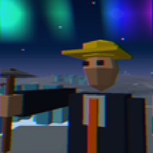

# UltraMelt 2 - updates

Current version: **v40** (see `version.txt`). What's new: `CHANGELOG.txt`.

Your game updates itself from here: start it, and if there's a new version,
click **UPDATE** at the top of the title screen. Everyone playing together
needs the same version.

The `.umx` files are scrambled and only open inside the game.
